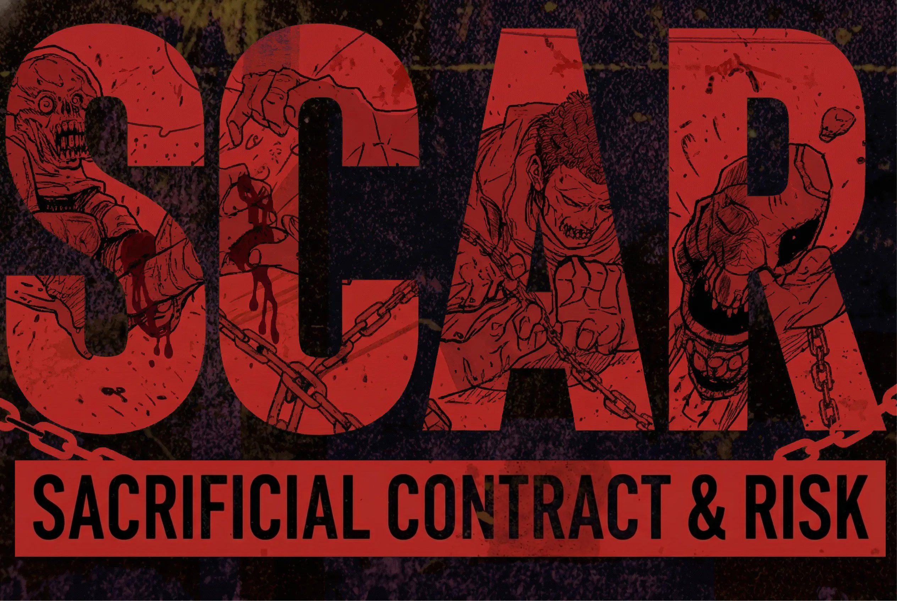
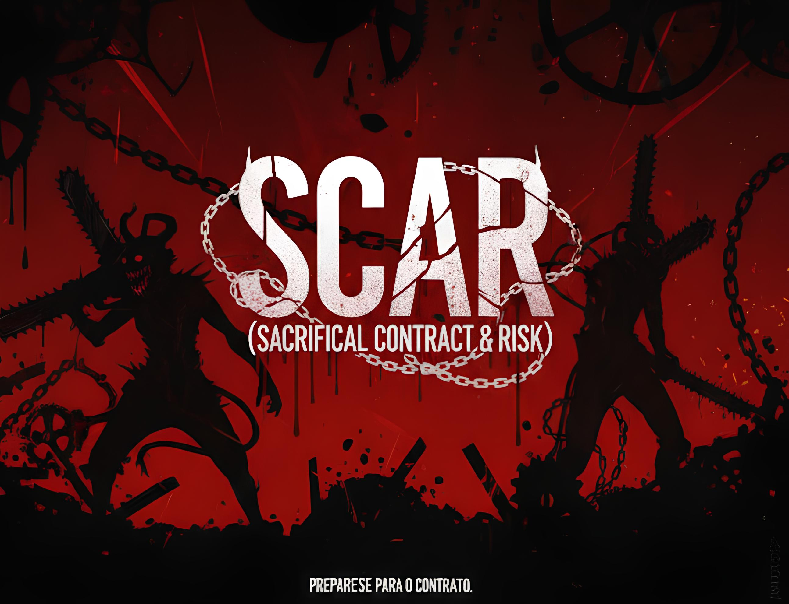

<h1 align="center">
  
</h1>

<p align="center">
  <strong>Sistema de RPG de mesa ambientado no universo brutal de Chainsaw Man</strong>
</p>

<p align="center">
  
  
  
</p>

<p align="center">
  <a href="#-sobre">Sobre</a> -
  <a href="#-sistema">Sistema</a> -
  <a href="#-como-jogar">Como Jogar</a> -
  <a href="#-website">Website</a> -
</p>

---

## 🩸 Sobre

**SCAR** (Sacrificial Contract & Risk) é um RPG de mesa onde demônios nascem dos medos humanos e poder **sempre** cobra um preço.

Inspirado no universo sombrio de **Chainsaw Man**, o jogo coloca os jogadores em um mundo onde:

- Demônios são manifestações dos medos coletivos da humanidade
- Contratos oferecem poder em troca de sacrifícios terríveis
- Cada escolha tem consequências reais e duradouras
- Sobreviver é tão importante quanto vencer
- Ninguém sai ileso — nem física, nem mentalmente

> *"SCAR nasceu da paixão por Chainsaw Man e RPGs de mesa. Cada regra foi pensada para capturar a brutalidade e a emoção do universo original."*
>
> — Jonathan Ribeiro, Criador

---

## ⚔️ Características

| Feature | Descrição |
|---------|-----------|
| **Brutalidade Autêntica** | Sistema que captura a violência e o peso emocional de Chainsaw Man |
| **Contratos Demoníacos** | Mecânicas detalhadas para pactos com demônios (5 tiers de poder) |
| **Stress & Injúrias** | Sistema de dano que afeta corpo e mente |
| **4 Naturezas Jogáveis** | Humanos, Infernais, Híbridos e Demônios — cada um com mecânicas exclusivas |
| **12 Estilos de Luta** | Combate personalizado para cada jogador |
| **Árvores de Pré-requisito** | 97 habilidades gerais organizadas em cadeias de progressão — escolhas com peso real |
| **Aflições** | 100 físicas + 100 mentais que marcam permanentemente os personagens |
| **Sistema de Sonhos** | Objetivos de vida que recompensam PM ao serem realizados (4 tiers) |
| **Rolador de Dados Multiplayer** | Sistema de dados online com sincronização em tempo real |

---

## 🎲 Sistema

### Mecânica Principal
```
Atributo + Habilidade + Xd10 vs Dificuldade
```
- **Sistema d10**: Rolagens usando dados de 10 faces
- Maior valor do dado determina sucesso ou falha
- Críticos e falhas críticas com consequências reais

### Recursos do Personagem

| Recurso | Descrição |
|---------|-----------|
| **Stress** | Sua resiliência mental e física (6 + Vigor + Vínculo) |
| **Injúrias** | Dano físico em 3 níveis: Leve (1-9), Grave (10-19), Crítica (20+) |
| **Aflições** | Condições negativas — algumas permanentes |
| **Vínculos** | Relações que ancoram sua humanidade |
| **PM (Pontos de Marca)** | Custo para criar contratos e poderes |
| **Sonhos** | Objetivos de vida — ao realizá-los, o jogador ganha PM |

### Tipos de Personagens

| Natureza | Descrição | Exclusivo |
|----------|-----------|-----------|
| **Humanos** | Mortais comuns, versáteis e numerosos. Brilham em equipe. | Adaptabilidade Humana + Força nos Números |
| **Infernais** | Demônios que possuíram cadáveres. Poderes inatos, aflições permanentes. | Detecção demoníaca |
| **Híbridos** | Meio humano, meio demônio — existência instável. Poder bruto com risco. | Grilhões + Recusa da Morte |
| **Demônios** | Seres imortais nascidos do medo coletivo. Evoluem por nível. | Evolução por Nível de Medo (1-5) |

### Sistema de Contratos

| Tier | Poder | Injúria Mínima | Custo PM |
|------|-------|----------------|----------|
| **Menor** | Limitado, utilitário | — | 2 PM |
| **Médio** | Forte, combate efetivo | Leve (1-9) | 3 PM |
| **Maior** | Destruidor, game-changer | Grave (10-19) | 4 PM |
| **Invocação** | Invoca entidade aliada | Varia | 3 PM |
| **Restrição** | Poder absoluto | Crítica (20+) | Aprovação Mestre |

---

## 📖 Como Jogar

1. **Escolha sua Natureza** — Humano, Infernal, Híbrido ou Demônio
2. **Distribua Atributos** — 16-22 pontos entre 10 atributos
3. **Calcule Stress** — 6 + Vigor + Vínculo (Humanos ganham +2 extra)
4. **Calcule Injúrias** — Leves: 2 + Vigor÷2 | Graves: 1 + Vigor÷3 | Crítica: sempre 1
5. **Escolha Estilo de Luta** — 12 estilos disponíveis (Boxe, Espadachim, Atirador, etc)
6. **Defina seu Talismã** — Objeto que ancora sua humanidade
7. **Contratos** (opcional) — Faça pactos com demônios (Humanos: 1 contrato)
8. **Preencha a Ficha** — Nome, história, medos

---

## 🌐 Website

### Acesse Online
🔗 **[jonathanrbo.github.io/SCAR](https://jonathanrbo.github.io/SCAR)**

O website oficial do SCAR oferece:

#### 📜 Páginas Principais
- **Home** - Apresentação completa do sistema com modais interativos
- **Manual Completo** - Manual navegável com visual de livro antigo (15 capítulos)
- **Habilidades** - 97 habilidades gerais com árvores de pré-requisito + 12 estilos de luta
- **Aflições** - 100 aflições físicas + 100 mentais com busca e filtros
- **Ficha Padrão** - Ficha de personagem interativa (Humano/Infernal/Híbrido)
- **Ficha Demônio** - Ficha específica para Demônios Puros

#### 🎲 Ferramentas
- **Rolador de Dados Multiplayer** - Sistema de dados online com:
  - Sincronização em tempo real via PeerJS
  - Sala com código de 6 dígitos
  - Histórico de rolagens
  - Suporte para múltiplos dados (1d10 até 10d10)
  - Interface dark theme

#### 📋 Recursos Interativos
- **Modal de Criar Contrato** - Formulário completo para criar contratos demoníacos
- **Tabelas Responsivas** - Todas as mecânicas em formato mobile-friendly
- **Animações WOW** - Interface animada e imersiva
- **Design Dark** - Visual sangue e trevas inspirado em Chainsaw Man

---

### Arquivos de Referência

Todos os arquivos de regras estão em [`documento/`](documento/):
- `regras.txt` - Regras base do sistema
- `pontos de marca.txt` - Sistema de PM
- `sistema de sonhos.txt` - Sistema de Sonhos (objetivos de vida)
- `aflições físicas.txt` - Aflições corporais
- `aflições mentais.txt` - Aflições psicológicas
- E mais 7 arquivos de referência

---

## 🛠️ Desenvolvimento

### Stack Técnica

| Tecnologia | Uso | Versão |
|------------|-----|--------|
| **Squeleton CSS v4** | Framework CSS base | CDN |
| **HTML5** | Estrutura semântica | - |
| **CSS3 Custom** | Estilos do tema dark | - |
| **JavaScript Vanilla** | Interações e lógica | ES6+ |
| **PeerJS** | Multiplayer no rolador | Latest |
| **WOW.js** | Animações on-scroll | Integrado |

### Estrutura de Arquivos

```
SCAR/
├── index.html              # Página principal
├── aflicoes.html           # Página de aflições (100 físicas + 100 mentais)
├── habilidades.html        # Página de habilidades (97 habilidades com pré-requisitos)
├── dice-roller.html        # Rolador multiplayer (PeerJS)
├── assets/
│   ├── css/
│   │   ├── main.css           # Estilos compartilhados
│   │   ├── contratos.css      # Estilos de contratos
│   │   └── page-styles.css    # Estilos específicos index
│   ├── js/
│   │   └── main.js            # JavaScript funcional
│   └── images/
├── docs/
│   ├── ficha-padrao.html      # Ficha de personagem padrão
│   └── ficha-demonio.html     # Ficha de Demônio Puro
└── documento/              # Arquivos de referência (.txt)
```

### Arquitetura CSS

O projeto usa uma **arquitetura CSS modular**:

1. **Squeleton v4** (via CDN) - Framework base com grid 12 colunas, utilitários e componentes
2. **main.css** - Estilos compartilhados (variáveis, cards, botões, animações)
3. **contratos.css** - Sistema de contratos (tier badges, cards especializados)
4. **page-styles.css** - Estilos específicos do index.html (hero, animações, blood effects)

**Classes Utilitárias Customizadas:**
- `.pm-cost-card` - Cards de custo de PM com variações de cor
- `.tipo-card` - Cards de tipos de seres (Humano, Infernal, etc)
- `.modal-icon` - Ícones grandes para modais
- `.cost-badge` - Badges de custo com cores por tier

### Contribuindo

1. Fork o projeto
2. Crie uma branch para sua feature (`git checkout -b feature/AmazingFeature`)
3. Commit suas mudanças (`git commit -m 'Add some AmazingFeature'`)
4. Push para a branch (`git push origin feature/AmazingFeature`)
5. Abra um Pull Request

#### Convenções de Código

- Use **classes do Squeleton** sempre que possível ao invés de CSS customizado
- Prefira **classes utilitárias** (`p-20-all`, `d-flex`) ao invés de inline styles
- Mantenha CSS em arquivos separados (não use `<style>` inline)
- Use **variáveis CSS** definidas em `main.css` (ex: `var(--cor-secundaria)`)
- Siga o padrão de nomenclatura: `.nome-componente-elemento`

---


### Futuras Melhorias
- [ ] Internacionalização (EN/ES)

---

## ⚖️ Licença

Este é um **projeto de fã**, criado para fins de entretenimento e **sem fins lucrativos**. Dúvidas, sugestões ou quer contribuir? Entre em contato!

**Chainsaw Man** é propriedade de **Tatsuki Fujimoto** e **Shueisha**. Este RPG é uma homenagem à obra original e não possui qualquer afiliação oficial com os detentores dos direitos.

---

<p align="center">
  
</p>

<p align="center">
  <em>"Todo contrato tem um preço. Você está disposto a pagar?"</em>
</p>

<p align="center">
  Feito com 🩸 por <a href="https://github.com/JonathanRbo">Jonathan Ribeiro</a>
</p>

<p align="center">
  <a href="https://jonathanrbo.github.io/SCAR">🌐 Acesse o Site Oficial</a>
</p>
